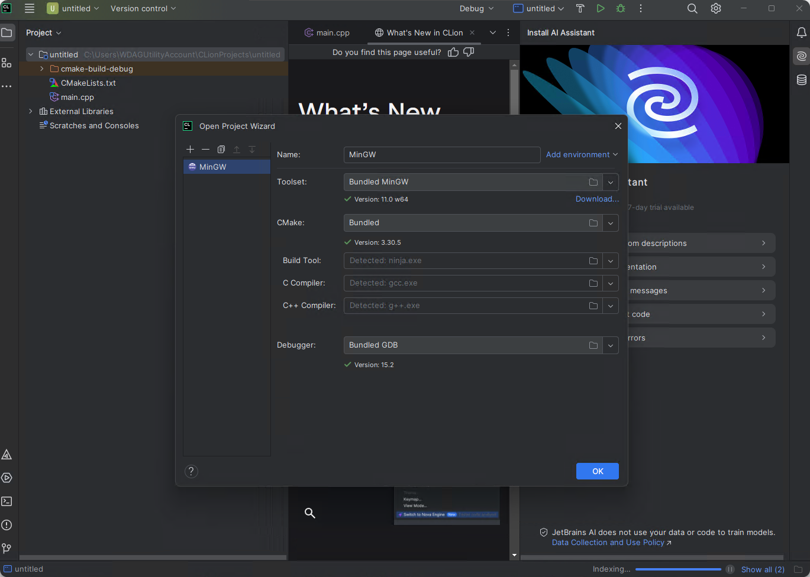
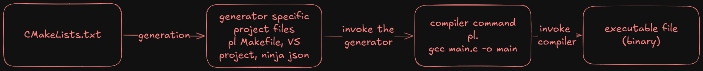

# CLion

A CLion a JetBrains által fejlesztett C/C++ fejlesztőkörnyezet. 2025 óta ingyenes személyes felhasználásra,
viszont hallgatói licensz is kérhető hozzá: <https://www.jetbrains.com/academy/student-pack>

## Fordítóprogram telepítése

A CLion fejlesztőkörnyezet automatikusan telepít egy MinGW *(Minimalist Gnu for Windows)*, ami egyes GNU eszközök Windows portja. 
Ez magában foglalja a GCC fordítóprogramot, valamint a GDB nyomkövetőt (debugger) is.

## Környezet beállítása

Ha letöltötted a programot és beléptél a JetBrains fiókoddal, akkor valami ilyesmi oldal fogad:


Válaszd a "New Project" opciót, ezen belül pedig a "C Executable" -t. Állítsd a standard verziót C11 -re, kb. ezt 
tanítja a tárgy is.

Okézd le ezt az ablakot. Ezután a CLion felajánlja a különböző *toolchain*-ek konfigurálását. CLion-ban egy toolchain egy fordítóprogramból, debuggerből és egy generátorból áll (erről később).



Mint már említettem, a CLion automatikusan telepít egy toolchain-t így neked ezzel nem kell fogalkoznod, nyomj az "Ok" gombra.

## Hello, World!

A fejlesztőkörnyezet automatikusan készít egy `main.c` forrásfájlt. Ebbe a file-ba az alábbi kódrészletet másold be:

```cpp
#include <stdio.h>

int main(void){
    printf("Hello, World!");

    return 0;
}
```

A jobb felső sarokban lévő kis zöld háromszögre kattintva indítsd el a programot.

## CMake

Talán észrevehetted, hogy a projektedben megjelent egy `CMakeLists.txt` nevű file is.

A CLion a *CMake* nevű *build system* -et használja.

### CMake működése röviden

A projekt "config" fileja a `CMakeLists.txt`. Ez a "script" írja le azt, hogy a projektben található forrásfájlokból
végül hogyan lesz használható program. A CMake egy deklaratív nyelv. Nem kell megmondani, hogy hogyan csinálja azt, amit csinál, csak azt kell megmondani, hogy **mit** csináljon.

A CMake önmagában nem build-system. A CMakeList alapján egy *generátor*-nak nevezett, tényleges build system -hez (pl. Make, Visual Studio, Ninja) generál projekt fileokat. A Ninja egy tökéletes választás, kicsi és gyors. Elvileg a CLion automatikusan telepíti.

Ezután a generátor build system (Ninja) a generált config alapján lefuttatja a fordítóprogramot, amely előállítja a végső bináris filet, ami már futtatható.



### Alapértelmezett CMakeLists.txt értelmezése

```cmake
cmake_minimum_required(VERSION 3.31)
project(stuff C)

set(CMAKE_C_STANDARD 11)

add_executable(stuff main.c)
```

* `cmake_minimum_required(VERSION 3.31)`: ez a sor csak azért van itt, mert kötelező. A minimum CMake verziót adja meg, amivel a projekt kompatibilis. Én a `3.25` -ös verziót szoktam használni, mivel néhány Linux distro még mindig ezt használja alapértelmezettként...
* `project(stuff C)`: a `project` deklarálja a projekt nevét (ez esetben "stuff"), a `C` pedig a projekt átlal használt nyelvet (nyelveket) adja meg. Így is írható: `project(stuff LANGUAGES C)`
* `set(CMAKE_C_STANDARD 11)`: megadja a projekt által használt C standard verziót. (C99, C11, C23, stb.)
* `add_executable(stuff main.c)`: deklarál egy futtatható (executable) CMake target -et és forrásfájlként hozzáadja a `main.c` nevű filet.

#### CMake target

CMake-ben egy target lehet executable, library, stb. 
Ezek azok az entitások, amikből később futtatható (vagy csatolható) kód képződik.

### Több fileos projektek

!!! warn
    A több forrásfileból álló projektek a tananyagban később szerepelnek, viszont a háziban követelmény így dolgozni

Jobb klikkelj a projekt mappájára:


Majd válaszd a `New>C/C++ Source file` opciót!


A következő felugró ablakban megadhatunk néhány dolgot:

* Name: a file neve. A fájlkiterjesztést (pl .c) **nem** kell megadni
* Type: a file típusa. Itt most a `.c` kell.
* Create associated header: Ha ez ki van pipálva, akkor létrejön egy ugyanilyen nevű header file is. 
  Sokszor header-source párokat csinálunk, ezért ez egy gyakran használt kapcsoló lesz.
* Add to targets: A kiválasztott CMake target-ekhez automatikusan hozzáadja az új forrásfájlokat.

Csinálj egy `foo.h` - `foo.c` file párt!


A projekt fájlstruktúrában megjelentek a `foo.h` és `foo.c` fájlok, valamint a `CMakeLists.txt` -ben is hozzá lett adva a két új file.

Írd át úgy a programot, hogy a `foo.h` deklarál egy `helloWorld` függvényt, a `foo.c` definiálja ezt úgy, hogy a függvény a `Hello, World!` szöveget írja a konzolra, a `main.c` pedig meghívja ezt a `helloWorld` függvényt!

```c
//foo.h

#pragma once

void helloWorld(void);
```

```c
//foo.c

#include "foo.h"
#include <stdio.h>

void helloWorld(void) {
    printf("Hello, World!\n");
}
```

```c
//main.c

#include "foo.h"

int main(void) {
    helloWorld();
    return 0;
}
```

A CMakeList -ben:

```cmake
add_executable(stuff main.c foo.c foo.h)
```

A programhoz mostmár 3 file tartozik. 

!!! note
    A CMake okos és tudja, hogy a header fileokat nem fordítjuk le önmagukban, 
    ezért ezeket egyébként ki fogja venni a végleges build-ből, viszont a fejlesztőkörnyezetek csak úgy fognak helyesen működni, 
    ha a header fileok is hozzá vannak adva a targethez.

!!! note
    Próbáld ki mi történik akkor, ha kiveszed a `foo.c` fájlt a targetből!
    A kód ugyan lefordul, de a linker nem talál definíciót a `helloWorld` függvényhet (Undefined Reference error).